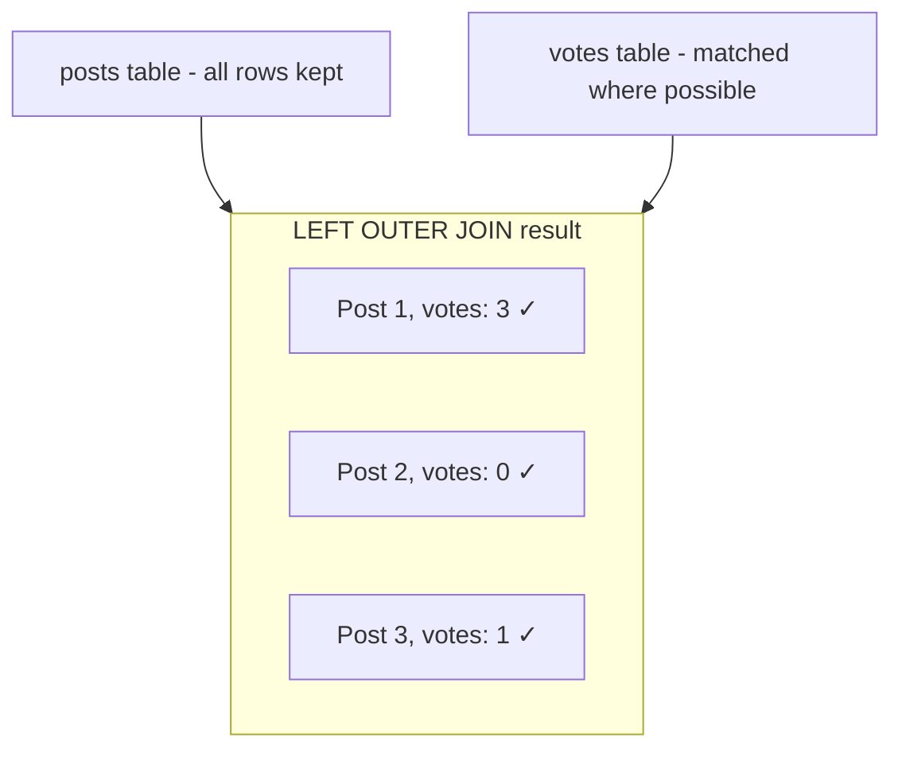
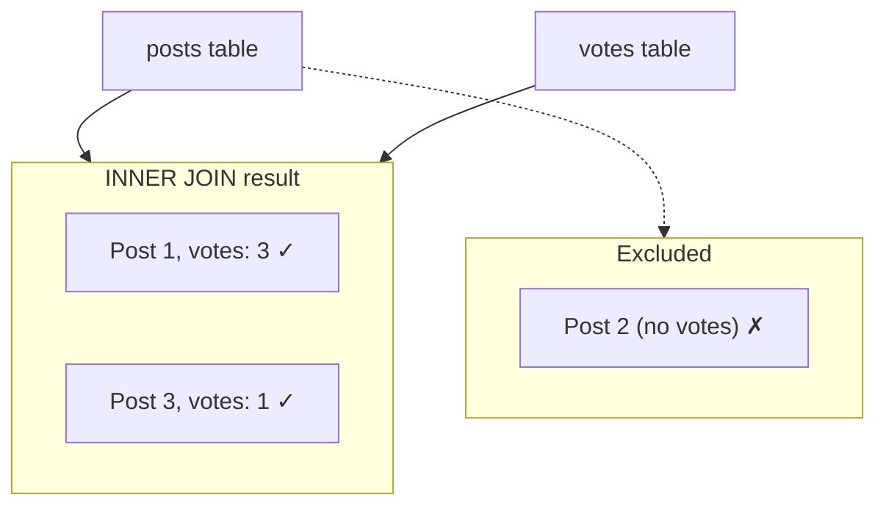

# SQLAlchemy Joins for Vote Counts

This note explains how joins are used to fetch posts with vote counts, including the role of `isouter` in SQLAlchemy.

## Overview

When fetching posts, we join the **posts** and **votes** tables to include the vote count per post. The join type determines whether posts with zero votes are included.

## Diagrams

### LEFT OUTER JOIN (`isouter=True`)

All rows from **posts** are returned. Matching votes are joined; posts with no votes get `votes=0`.



### INNER JOIN (`isouter=False`)

Only rows that exist in **both** tables are returned. Posts with no votes are excluded.



## `isouter` Parameter

In SQLAlchemy, `join(..., isouter=True)` creates a **LEFT OUTER JOIN** (all posts included). `isouter=False` (the default) creates an **INNER JOIN** (only posts with votes).

| `isouter` | Join Type      | Behavior                                                                 |
|-----------|----------------|---------------------------------------------------------------------------|
| `True`    | LEFT OUTER JOIN| All rows from the left table (posts). Posts with no votes are included.  |
| `False`   | INNER JOIN     | Only rows that match in both tables. Posts with no votes are excluded.   |

## Query Breakdown

The full query and what each part does:

```python
db.query(Post, func.count(Vote.post_id).label("votes"))
   .join(Vote, Vote.post_id == Post.id, isouter=True)
   .group_by(Post.id)
```

| Part | Purpose |
|------|---------|
| `db.query(Post, ...)` | Select columns from the query. First argument: the full `Post` model (all post columns). Second argument: an expression to compute. |
| `func.count(Vote.post_id)` | SQL `COUNT(votes.post_id)`. Counts rows in the votes table per post. Using `Vote.post_id` (not `*`) counts non-null vote rows; with LEFT OUTER JOIN, posts with no votes get one joined row with NULL, and `COUNT` ignores NULL, so the result is 0. |
| `.label("votes")` | Aliases the count column as `votes` in the result, so we can access it as `row[1]` or `row.votes`. |
| `.join(Vote, Vote.post_id == Post.id, ...)` | Join `votes` to `posts` where `votes.post_id = posts.id`. This links each vote row to its post. |
| `isouter=True` | Use LEFT OUTER JOIN so every post row is kept even when no votes match. `isouter=False` would use INNER JOIN and drop posts with no votes. |
| `.group_by(Post.id)` | Collapse multiple vote rows per post into one row per post. Required when using `COUNT` with other columns; each post must appear once so the count is per post. |

**Equivalent SQL (conceptually):**

```sql
SELECT posts.*, COUNT(votes.post_id) AS votes
FROM posts
LEFT OUTER JOIN votes ON votes.post_id = posts.id
GROUP BY posts.id
```

**Why `func.count(Vote.post_id)` and not `func.count(Post.id)`?**  
`COUNT(Post.id)` would always be 1 per group (each post has one id). `COUNT(Vote.post_id)` counts the joined vote rows; for a post with no votes, the LEFT JOIN produces one row with `votes.post_id = NULL`, and `COUNT` ignores NULL, yielding 0.

## Examples

### Sample Data for This Scenario

**posts**

| id | title   | content | owner_id |
|----|---------|---------|----------|
| 1  | Hello   | ...     | 10       |
| 2  | New     | ...     | 10       |
| 3  | World   | ...     | 11       |

**votes** (post_id, user_id)

| post_id | user_id |
|---------|---------|
| 1       | 20      |
| 1       | 21      |
| 1       | 22      |
| 3       | 23      |

Post 1 has 3 votes; post 2 has 0 votes; post 3 has 1 vote.

---

### `isouter=True` (LEFT OUTER JOIN)

```python
query = db.query(Post, func.count(Vote.post_id).label("votes")).join(
    Vote, Vote.post_id == Post.id, isouter=True
).group_by(Post.id)
```

**Result:** All posts appear. Posts with no votes show `votes=0`.

| Post ID | Title | Votes |
|---------|-------|-------|
| 1       | Hello | 3     |
| 2       | New   | 0     |
| 3       | World | 1     |

*(Post 2 has no rows in votes; the join still returns it with `votes=0`.)*

---

### `isouter=False` (INNER JOIN)

```python
query = db.query(Post, func.count(Vote.post_id).label("votes")).join(
    Vote, Vote.post_id == Post.id, isouter=False  # or omit; False is default
).group_by(Post.id)
```

**Result:** Only posts that have at least one vote appear. Posts with zero votes are dropped.

| Post ID | Title | Votes |
|---------|-------|-------|
| 1       | Hello | 3     |
| 3       | World | 1     |

*(Post 2 has no matching rows in votes, so it is excluded from the result.)*

## Why We Use `isouter=True`

For listing posts, we want every post to appear, including those with no votes. A LEFT OUTER JOIN keeps all posts and returns 0 for the vote count when there are no matching rows in `votes`.

See [posts/service.py](../../../app/posts/service.py) for the implementation in `get_posts` and `get_post_with_votes`.
