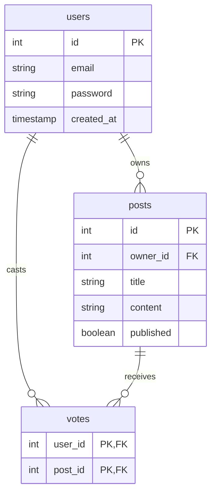

# Votes Table

This note explains why the **votes** table exists and how it models the relationship between users and posts.

## Diagram

## Purpose

Votes represent a **many-to-many** relationship:

- One user can vote on many posts
- One post can receive votes from many users

A separate table is required because this relationship cannot be modeled with a single column on either `users` or `posts`.

## Why Not Add a Column on Posts?

A `votes` column on `posts` could store a count, but:

- It would not record *who* voted
- You could not enforce "one vote per user per post"
- You could not remove a vote when a user changes their mind

## Why Not Add a Column on Users?

A `voted_posts` column on `users` would need to store multiple post IDs, which is awkward and inefficient.

## Why a Separate Votes Table?

The **votes** table is a junction table that:

- Stores one row per user–post pair: `(user_id, post_id)`
- Uses a composite primary key to enforce one vote per user per post
- Allows adding and removing votes by inserting or deleting rows
- Enables counting votes per post with `COUNT(*)`
- Enables checking whether a user voted for a post with a simple query

## Schema

| Table   | Purpose                                      |
|---------|----------------------------------------------|
| `users` | User accounts                                |
| `posts` | Posts (with `owner_id` → `users`)            |
| `votes` | Which user voted for which post (user_id, post_id) |

See [posts/models.py](../../../app/posts/models.py) for the `Vote` model definition.
