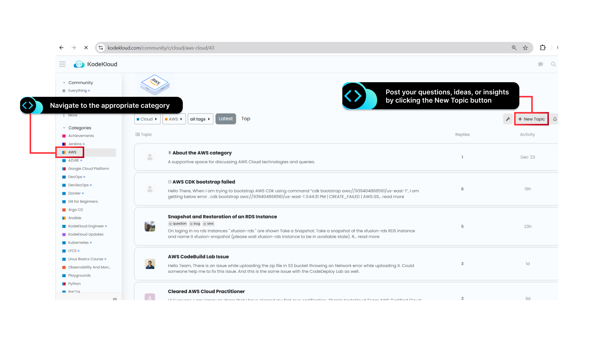
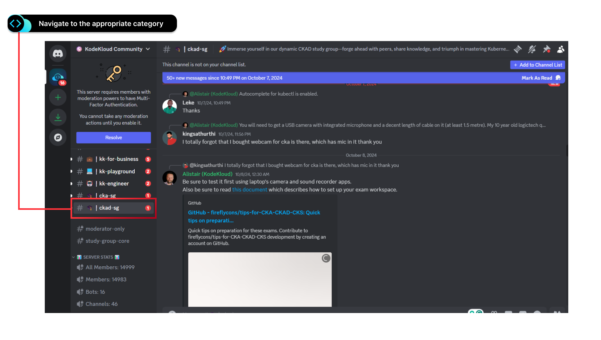
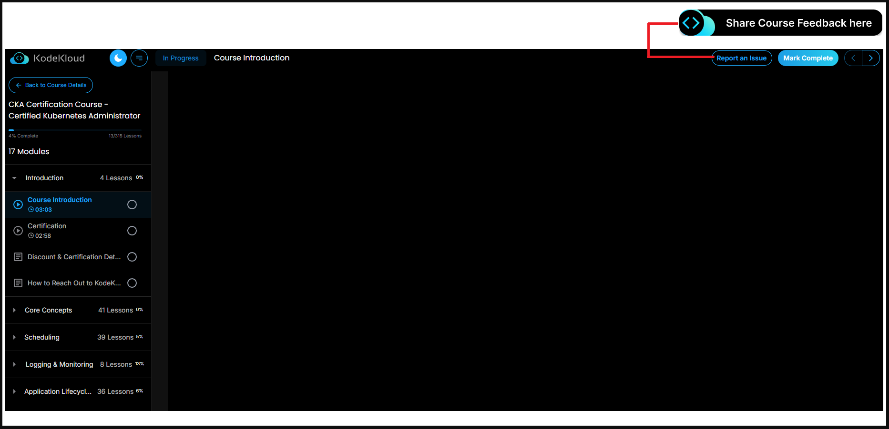

# How to Reach Out to KodeKloud and Engage with the Community

We at KodeKloud are committed to supporting your learning journey. To help you get the most out of our platform,
we offer three dedicated channels for assistance and engagement. Here's how you can use them effectively:

## 1. KodeKloud Community Forum

[Join the Community Forum](https://kodekloud.com/community/)

**Purpose:** To ask technical questions, engage in discussions, and receive insights from fellow learners and experts.

**How to Use:**

- Sign up or log in to the forum
- Navigate to the appropriate category (e.g., Cloud, DevOps, or a specific certification)
- Use relevant tags for better organization and visibility (e.g., AWS, Kubernetes, Terraform)
- Post your questions, ideas, or insights by clicking the **New Topic** button

## 2. Discord Channel

**Purpose:** This is for real-time collaboration, networking, and staying updated on the latest in DevOps and Cloud.

**How to Use:**

Join our [Discord server](https://discord.gg/VAfhT6ZR9E). Participate in:

- **Study groups:** Join groups for collaborative learning
- **Networking:** Connect with peers and professionals in the industry
- **Sharing achievements:** Showcase your certifications, projects, or milestones
- **Career guidance:** Get tips on hiring processes, certifications, and project ideas
- **Tech discussions:** Stay updated on tools, techniques, and trends in the field

**Why Use It:** The Discord channel is a dynamic space to network, learn from others, and grow as a professional in
the DevOps and Cloud domains.

## 3. Feedback Button on the Course Page

**Purpose:** This is for sharing feedback about the course.

**How to Use:**

- Locate the **Feedback** button on your course page
- Use this to:
  - Ask questions about the specific course you're taking
  - Share general feedback about the course

## Need Help Deciding?

If you're unsure where to post, follow this guideline:

| Question Type                | Channel         |
|------------------------------|-----------------|
| Is it course-specific?       | Feedback button |
| Technical or conceptual?     | Community Forum |
| Collaboration or networking? | Discord         |

These channels are here to enhance your experience and foster a vibrant learning community.
