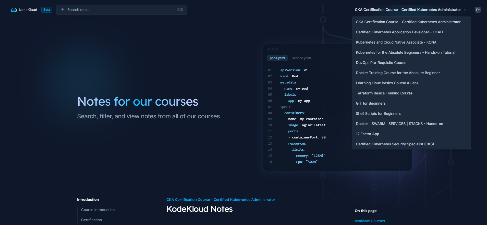
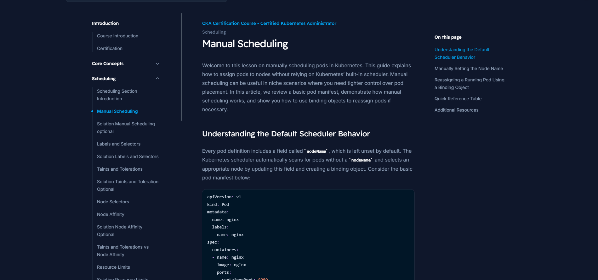
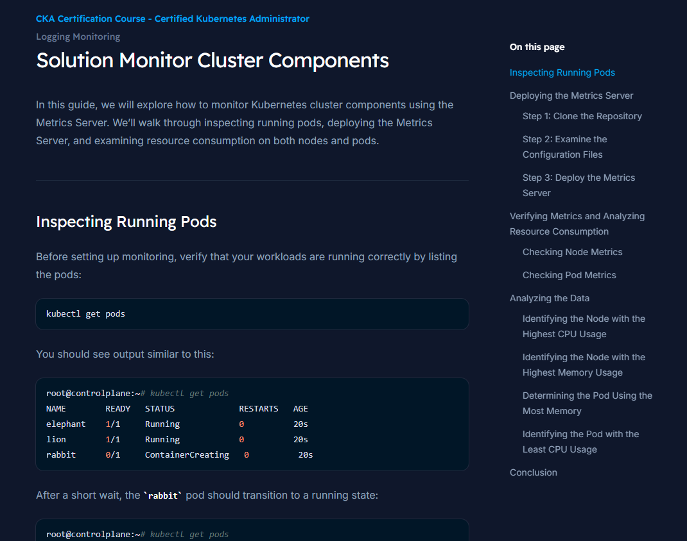

# Notes Available at KodeKloud Notes

**KodeKloud Notes** provides detailed documentation and learning materials for our courses. Each course section is
carefully organized to help you:

- Follow along with course lectures
- Review key concepts and commands
- Prepare for certification exams
- Reference materials during your learning journey

## How to Use

[Access KodeKloud Notes](https://notes.kodekloud.com/)

- Select your course from the dropdown menu at the top

- Navigate through sections using the sidebar

- Use the search function to find specific topics

- Follow the sequential order or jump to specific sections as needed

## Features

| Feature                         | Description                                                |
|---------------------------------|------------------------------------------------------------|
| **Comprehensive Documentation** | Detailed notes covering all course topics                  |
| **Easy Navigation**             | Well-organized content structure with intuitive navigation |
| **Search Functionality**        | Quickly find the content you need                          |
| **Dark/Light Mode**             | Choose your preferred reading experience                   |
| **Mobile Friendly**             | Access your learning materials on any device               |
